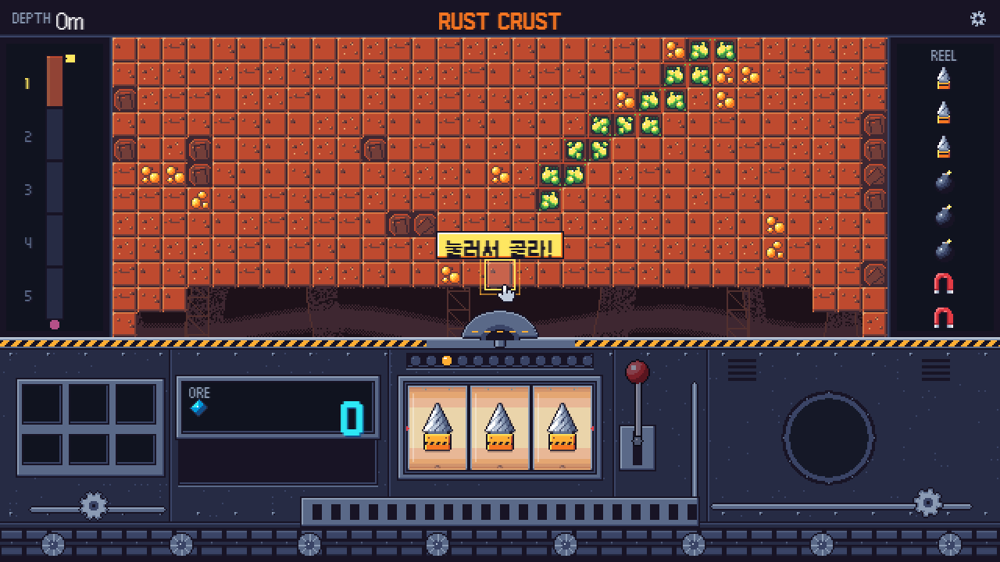
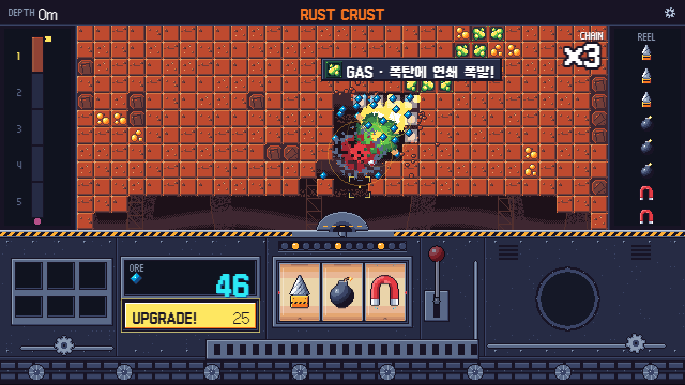
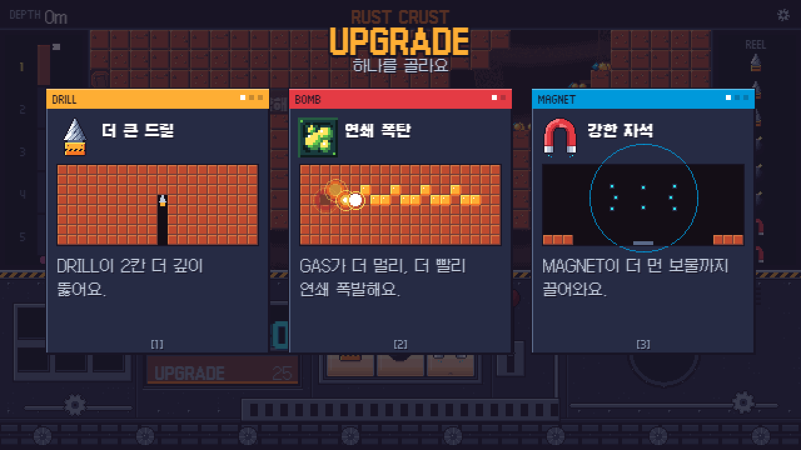

# COREBREAK

**부술 곳을 고르고, 레버를 당기고, 연쇄 반응을 지켜보세요.**

COREBREAK는 지층을 파고들며 굴착기를 키우는 브라우저용 픽셀 아트 액션 증분 게임입니다.




## 게임 소개

화면 위 지층에서 목표를 고른 뒤 레버를 당기면 세 개의 릴이 **DRILL · BOMB · MAGNET** 행동을 결정합니다. 암석을 뚫고, 폭발을 연쇄시키고, 흩어진 광물을 모아 업그레이드하세요. 아래로 내려갈수록 새로운 지층과 장애물이 등장하며 마지막에는 CORE에 도달합니다.

| 행동 | 역할 |
| --- | --- |
| **DRILL** | 목표 지점을 향해 암석을 뚫습니다. |
| **BOMB** | 주변을 폭파하고 GAS·폭탄돌과 연쇄 반응을 일으킵니다. |
| **MAGNET** | 흩어진 광물을 끌어모읍니다. |

## 플레이 화면

### 연쇄 반응



암석의 종류와 릴 결과가 맞물리면 폭발과 채굴이 이어집니다. 같은 그림 세 개가 나오면 강력한 **MEGA** 행동이 발동합니다.

### 업그레이드 선택



모은 ORE로 세 장의 업그레이드 카드 중 하나를 골라 굴착 방식을 바꿉니다. 진행하면서 봇과 FEVER도 사용할 수 있습니다.

## 조작

| 입력 | 동작 |
| --- | --- |
| 지층 클릭 | 굴착 목표 선택 |
| 레버 클릭 또는 `Space` | 릴 실행 |
| `UPGRADE!` 클릭 | ORE를 사용해 업그레이드 카드 열기 |
| 카드 클릭 또는 `1` · `2` · `3` | 카드 선택 |
| `FEVER!` 클릭 | 게이지가 준비되면 FEVER 발동 |
| 오른쪽 위 톱니바퀴 | 소리·화면 효과 등 설정 |

처음 실행하면 화면 안내에 따라 두 번의 튜토리얼 굴착을 진행합니다. 진행 상황과 설정은 브라우저의 로컬 저장소에 저장됩니다.

## 실행

Node.js **20.x의 20.19 이상** 또는 **22.12 이상**이 필요합니다. Windows에서는 [`run.bat`](run.bat)을 더블클릭하면 필요한 패키지를 확인하고 개발 서버를 열 수 있습니다.

터미널에서 직접 실행하려면:

```bash
npm ci
npm run dev
```

터미널에 표시된 로컬 주소를 WebGL을 지원하는 브라우저에서 여세요. 배포용 빌드는 `npm run build`로 생성하며 결과물은 `dist/`에 저장됩니다.

## 구성

- `src/sim/` — 광산, 릴, 업그레이드 및 진행 규칙
- `src/scenes/`, `src/view/` — Phaser 화면과 효과
- `src/art/`, `src/audio/` — 픽셀 아트와 사운드
- `src/save.ts` — 로컬 저장과 설정
- `tools/` — 빌드 외 브라우저 검증 및 밸런스 도구

스크린샷은 실제 브라우저 실행 화면을 캡처한 것입니다.
